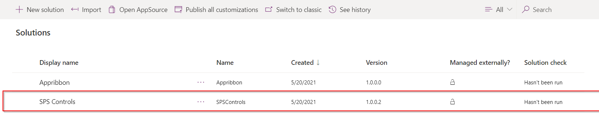
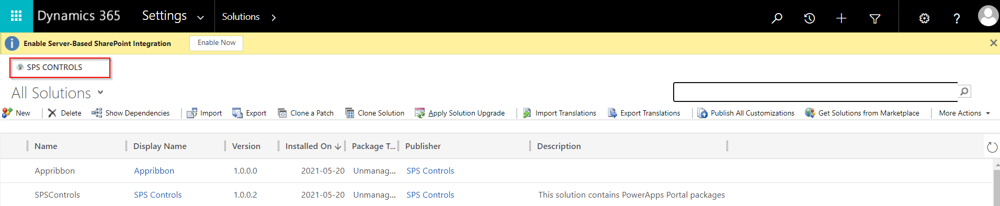
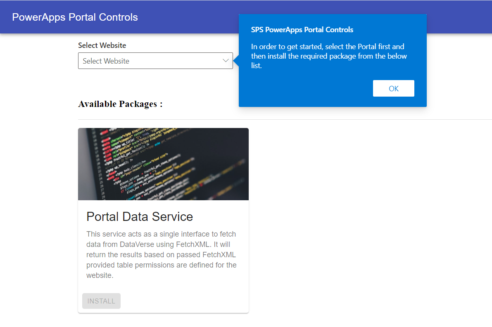
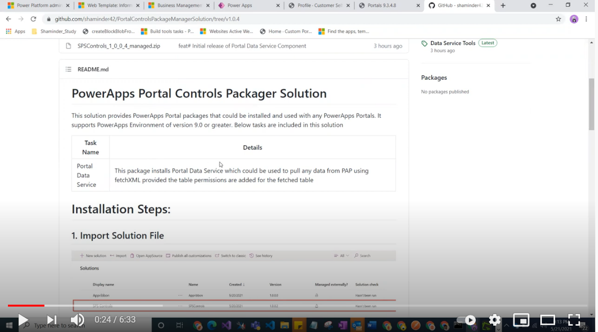

# PowerApps Portal Controls Packager Solution
This solution provides PowerApps Portal packages that could be installed and used with any PowerApps Portals. It supports PowerApps Environment of version 9.0 or greater.
Below tasks are included in this solution 

Task Name | Details
--------- | -----------
Portal Data Service | This package installs Portal Data Service which could be used to pull any data from PAP using fetchXML provided the table permissions are added for the fetched table

# Installation Steps:

## 1. Import Solution File
 
## 2. Open Classic Interface and click SPS controls 

## 3. Install Portal Data Service

## 4. Add a reference to SPS Custom Controls file in Header Template
```html
<!-- Add below line of script at the end of Header Web Template -->
<script src="/spscontrols.js"></script>
```
## 5. Portal Fetch Calls
```javascript
/*
Once you include the above script in header and clear your Portal Cache, all the portal pages will have access to
SPSControls object and this could be used to execute any fetch call.

Note: Please make sure to add appropriate table permissions for the fetched entity to your Portal Web Roles,
otherwise it will return back an empty array. 
*/

//Sample Code for different field types:
SPSControls.executeFetch(`<fetch version="1.0" output-format="xml-platform" mapping="logical" distinct="false">
  <entity name="contact">
    <attribute name="fullname" />
    <attribute name="telephone1" />
    <attribute name="parentcustomerid" />
    <attribute name="contactid" />
    <attribute name="preferredcontactmethodcode" />
    <order attribute="fullname" descending="false" />
    <link-entity name="account" from="accountid" to="parentcustomerid" visible="false" link-type="outer" alias="accountEntity">
      <attribute name="accountnumber" />
    </link-entity>
  </entity>
</fetch>`).then(function(results){
    const record= results[0];
    const fullName=record.find(x=>x.colName==='fullname');
    if(fullName){
        //For primitive fields
        console.log('fullname',fullName.colValue);
    }
    const account=record.find(x=>x.colName==='parentcustomerid');
    if(account){
        //For lookup fields
        //To get ID
        console.log('accountid',account.colValue.id);
        //To get Name
        console.log('accountname',account.colValue.name);
    }
    const preferredMethodCode=record.find(x=>x.colName==='preferredcontactmethodcode');
    if(preferredMethodCode){
        //For Picklist fields
        //To get value
        console.log('preferredMethodCode',preferredMethodCode.colValue.value);
        //To get label
        console.log('preferredMethodCodeLabel',preferredMethodCode.colValue.name);
    }
    const accountnumber=record.find(x=>x.colName==='accountEntity.accountnumber'); //For related entity fields, search via <alias.logicalname>
    if(accountnumber){
        //Related entity fields
        console.log('AccountNumber',accountnumber.colValue);
    }
},function(error){
    console.error(error);
});
```

Below is the result of above function executed in browser console:


For more details, see below:
[](https://www.youtube.com/watch?v=BO-0KpfruEU)


